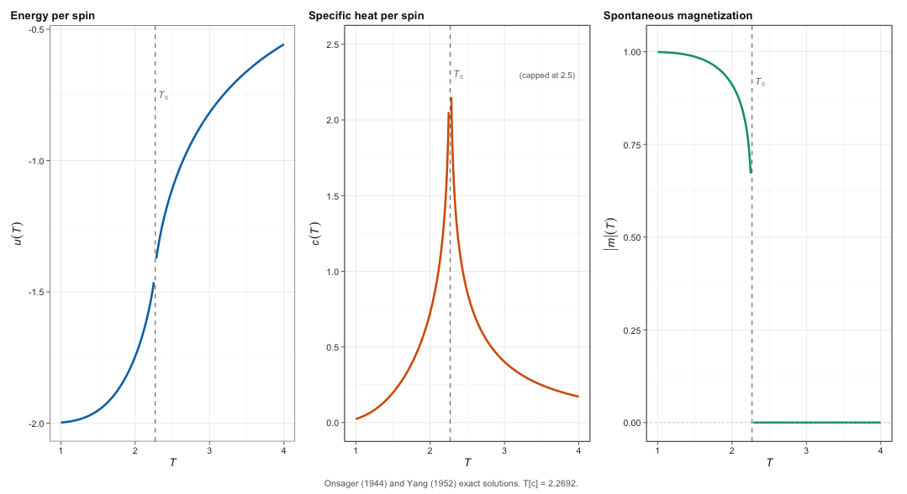
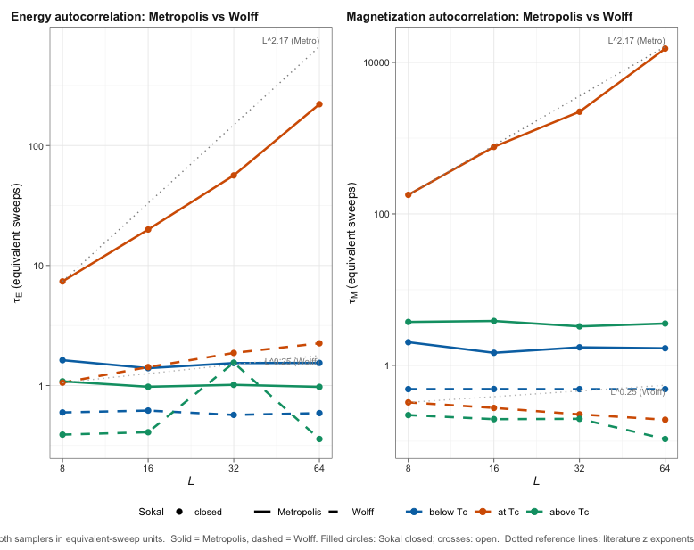
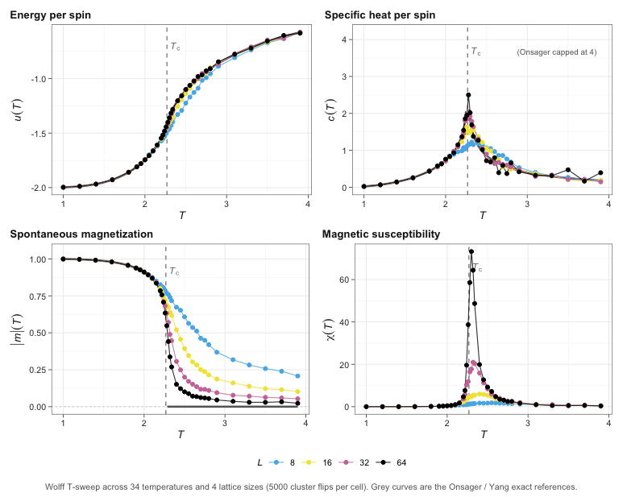
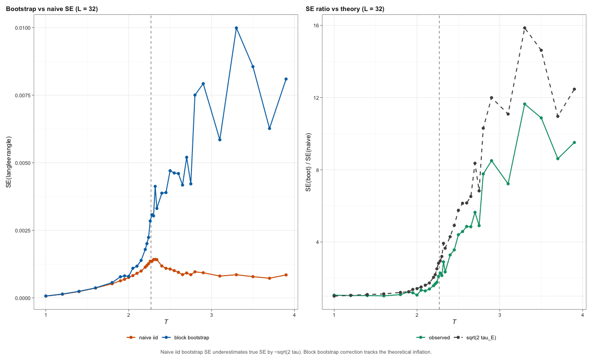
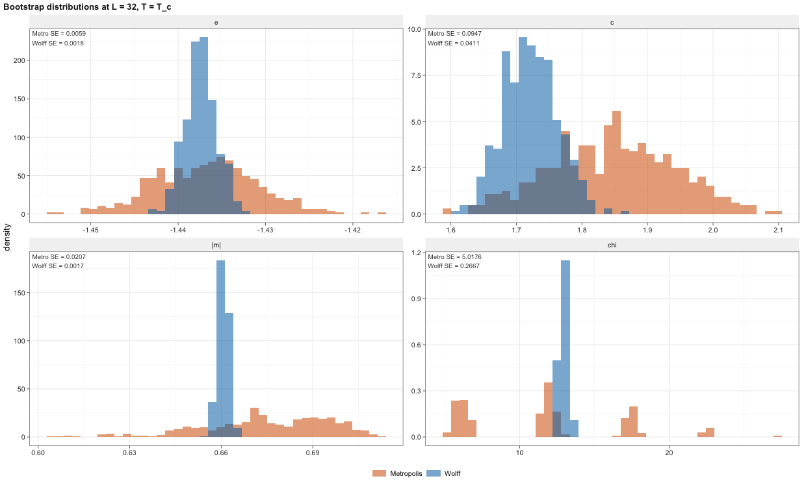
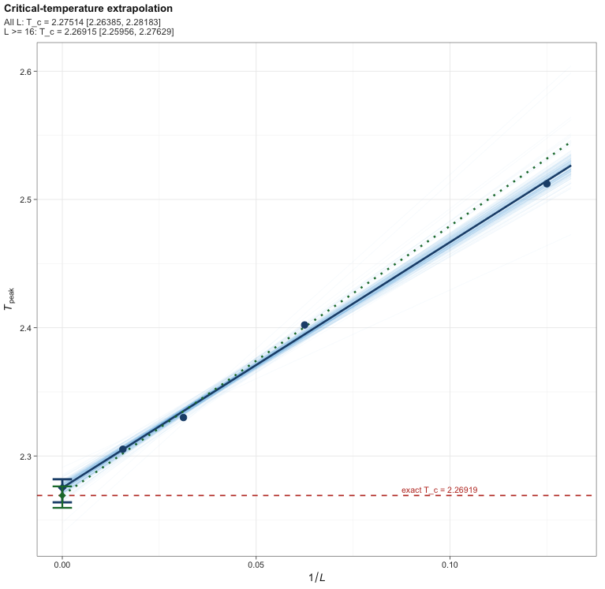

## Outline {#outline .smaller}

::: {.columns}
::: {.column width="50%"}

**Background**

1. Ferromagnets and Phase Transitions
2. Why the 2D Ising Model?
3. The Model: Hamiltonian and Observables
4. Exact Ground Truth (Onsager & Yang)
5. The Challenge: Critical Slowing Down

**Methods**

6. Single-Spin Metropolis–Hastings
7. Wolff Cluster Algorithm
8. Mixing Diagnostics ($\tau_{\text{int}}$, ESS, Sokal)
9. Block Bootstrap for Autocorrelated Chains

:::
::: {.column width="50%"}

**Results**

10. Sampler Mixing Comparison
11. Dynamic Critical Exponents
12. Validation vs. Ground Truth
13. Phase Transition with Bootstrap CIs
14. Bootstrap Calibration: $\sqrt{2\tau}$ Law
15. Head-to-Head at Criticality
16. Headline: $T_c$ to Four Decimals

**Wrap-up**

17. Conclusions & Contributions

:::
:::


## Ferromagnetism and Temperature {#ferromagnet .smaller}

::: {.columns}
::: {.column width="40%"}

**Ferromagnets** (iron, nickel, cobalt) are materials whose atomic spins **prefer to align** with their neighbors.

- At **low temperature**, thermal energy is too weak to overcome the alignment-favoring coupling — spins lock into a globally **ordered** state with non-zero magnetization $|m| > 0$.
- At **high temperature**, thermal fluctuations dominate — spins flip independently, the material loses its magnetization, $|m| \to 0$.
- At a sharp **critical temperature** $T_c$ (the *Curie point*), the material undergoes a continuous **phase transition**.

**Try it →** Drag the temperature slider. Watch the lattice order, disorder, and the magnetization meter respond in real time.

:::
::: {.column width="60%"}

```{ojs}
//| echo: false

viewof T_demo = Inputs.range([1.0, 4.0], {value: 2.27, step: 0.05, label: "Temperature T"})
```

```{ojs}
//| echo: false
ferroViz = {
  const W = 540, H = 360;
  const gold = "#F1B82D", black = "#000000", dkGold = "#C4972A";
  const ltGray = "#F5F2EB", gray = "#4A4A4A";
  const upColor = "#000000", downColor = "#F1B82D";

  const svg = d3.create("svg")
    .attr("viewBox", `0 0 ${W} ${H}`)
    .style("width","100%").style("max-width",`${W}px`)
    .style("font-family","system-ui, sans-serif");

  svg.append("rect").attr("width",W).attr("height",H)
    .attr("rx",10).attr("fill",ltGray).attr("stroke",dkGold);

  // Title
  svg.append("text").attr("x", W/2).attr("y", 22)
    .attr("text-anchor","middle").attr("font-size",13).attr("fill",black).attr("font-weight",700)
    .text(`32 × 32 Ising Lattice  —  T = ${T_demo.toFixed(2)}`);

  // ---- Mini Metropolis run to equilibrate at this T ----
  const L = 32;
  const N = L*L;
  const beta = 1.0 / T_demo;
  // Five-entry exp table for dE in {-8,-4,0,+4,+8}
  const tab = [Math.exp(-beta*-8), Math.exp(-beta*-4), 1, Math.exp(-beta*4), Math.exp(-beta*8)];
  // Cold start below Tc, random above
  let s = new Int8Array(N);
  if (T_demo < 2.27) {
    s.fill(1);
  } else {
    for (let i=0;i<N;i++) s[i] = Math.random() < 0.5 ? -1 : 1;
  }
  // Seeded RNG for reproducibility per slider value
  let seed = Math.floor(T_demo * 1e6);
  function rng() {
    seed = (seed * 1664525 + 1013904223) >>> 0;
    return seed / 4294967296;
  }
  // Sweeps
  const nSweeps = 400;
  for (let sweep=0; sweep<nSweeps; sweep++) {
    for (let step=0; step<N; step++) {
      const i = Math.floor(rng()*L);
      const j = Math.floor(rng()*L);
      const idx = i*L + j;
      const up = s[((i-1+L)%L)*L + j];
      const dn = s[((i+1)%L)*L + j];
      const lt = s[i*L + ((j-1+L)%L)];
      const rt = s[i*L + ((j+1)%L)];
      const dE = 2 * s[idx] * (up + dn + lt + rt);
      const k = (dE + 8) / 4;
      if (dE <= 0 || rng() < tab[k]) s[idx] = -s[idx];
    }
  }
  // Compute magnetization
  let M = 0;
  for (let i=0;i<N;i++) M += s[i];
  const mAbs = Math.abs(M)/N;

  // ---- Draw lattice ----
  const padL=20, padT=40, padR=180, padB=20;
  const sideW = W - padL - padR;
  const sideH = H - padT - padB;
  const side = Math.min(sideW, sideH);
  const cell = side / L;
  const ox = padL + (sideW - side) / 2;
  const oy = padT;

  for (let i=0;i<L;i++) {
    for (let j=0;j<L;j++) {
      const v = s[i*L + j];
      svg.append("rect")
        .attr("x", ox + j*cell).attr("y", oy + i*cell)
        .attr("width", cell).attr("height", cell)
        .attr("fill", v === 1 ? upColor : downColor)
        .attr("stroke","none");
    }
  }
  // Lattice frame
  svg.append("rect").attr("x", ox).attr("y", oy)
    .attr("width", side).attr("height", side)
    .attr("fill","none").attr("stroke", dkGold).attr("stroke-width",1.5);

  // ---- Magnetization meter ----
  const mx = W - padR + 20;
  const my = padT + 30;
  const mh = 200;
  const mw = 28;

  svg.append("text").attr("x", mx + mw/2).attr("y", my - 12)
    .attr("text-anchor","middle").attr("font-size",11).attr("fill",black).attr("font-weight",700)
    .text("|m|");

  // Meter outline
  svg.append("rect").attr("x", mx).attr("y", my)
    .attr("width", mw).attr("height", mh)
    .attr("fill","white").attr("stroke", gray).attr("stroke-width",1.2);

  // Filled portion
  const fillH = mh * mAbs;
  svg.append("rect").attr("x", mx).attr("y", my + mh - fillH)
    .attr("width", mw).attr("height", fillH)
    .attr("fill", "#e74c3c");

  // Tick marks
  [0, 0.25, 0.5, 0.75, 1.0].forEach(t => {
    svg.append("line")
      .attr("x1", mx+mw).attr("x2", mx+mw+4)
      .attr("y1", my + mh*(1-t)).attr("y2", my + mh*(1-t))
      .attr("stroke", gray);
    svg.append("text").attr("x", mx+mw+7).attr("y", my + mh*(1-t)+3)
      .attr("font-size", 8).attr("fill", gray).text(t.toFixed(2));
  });

  // Numerical readout
  svg.append("text").attr("x", mx + mw/2).attr("y", my + mh + 18)
    .attr("text-anchor","middle").attr("font-size",11).attr("fill","#e74c3c").attr("font-weight",700)
    .text(mAbs.toFixed(3));

  // Phase label
  let phaseText, phaseColor;
  if (T_demo < 2.20) { phaseText = "ORDERED"; phaseColor = "#27ae60"; }
  else if (T_demo > 2.34) { phaseText = "DISORDERED"; phaseColor = "#e74c3c"; }
  else { phaseText = "CRITICAL"; phaseColor = dkGold; }

  svg.append("text").attr("x", mx + mw/2).attr("y", my + mh + 42)
    .attr("text-anchor","middle").attr("font-size",10).attr("fill", phaseColor).attr("font-weight",700)
    .text(phaseText);

  // Tc reference
  svg.append("text").attr("x", mx + mw/2).attr("y", my + mh + 60)
    .attr("text-anchor","middle").attr("font-size",9).attr("fill", gray)
    .text("T_c ≈ 2.269");

  return svg.node();
}
```

:::
:::

<!--
## Why the 2D Ising Model? {#motivation .smaller}

::: {.columns}
::: {.column width="55%"}

**The 2D Ising model occupies a unique position:**

It is one of the **few non-trivial systems** with a closed-form analytical solution **and** a canonical example where standard MCMC samplers **fail catastrophically**.

**Two ingredients make it a perfect testbed for computational statistics:**

- **Exact infinite-volume answers** from Onsager (1944) and Yang (1952) — every estimator can be benchmarked against ground truth.
- **Critical slowing down** — at $T_c$, single-site MCMC autocorrelation grows as $\tau \sim L^z$ with $z \approx 2.17$. Doubling the lattice multiplies the inferential cost by ~5×.

**This project uses it to:**

- Compare Metropolis vs. Wolff cluster from scratch
- Quantify mixing through $\tau_{\text{int}}$ and ESS
- Build **honest** confidence intervals via block bootstrap
- Recover $T_c$ to four decimal places from finite-size scaling

:::
::: {.column width="45%"}

```{ojs}
//| echo: false
motivationViz = {
  const W = 420, H = 320;
  const gold = "#F1B82D", black = "#000000", dkGold = "#C4972A";
  const ltGray = "#F5F2EB", gray = "#4A4A4A";

  const svg = d3.create("svg")
    .attr("viewBox", `0 0 ${W} ${H}`)
    .style("width","100%").style("max-width",`${W}px`)
    .style("font-family","system-ui, sans-serif");

  svg.append("rect").attr("width",W).attr("height",H)
    .attr("rx",10).attr("fill",ltGray).attr("stroke",dkGold);

  svg.append("text").attr("x", W/2).attr("y", 22)
    .attr("text-anchor","middle").attr("font-size",12).attr("fill",black).attr("font-weight",700)
    .text("Two pillars of this project");

  // Two side-by-side cards
  const cards = [
    {x:20,  y:50, label:"Exact Ground Truth", desc:"Onsager (1944), Yang (1952)", detail:"u(T), c(T), |m|(T) in closed form", color:"#2980b9"},
    {x:220, y:50, label:"Critical Slowing", desc:"τ ~ L^2.17 at T_c", detail:"Local samplers degrade as L grows", color:"#e74c3c"},
  ];

  cards.forEach(c => {
    svg.append("rect").attr("x",c.x).attr("y",c.y).attr("width",180).attr("height",100).attr("rx",8)
      .attr("fill","white").attr("stroke",c.color).attr("stroke-width",2);
    svg.append("text").attr("x",c.x+90).attr("y",c.y+22).attr("text-anchor","middle").attr("font-size",12).attr("fill",black).attr("font-weight",700).text(c.label);
    svg.append("text").attr("x",c.x+90).attr("y",c.y+45).attr("text-anchor","middle").attr("font-size",10).attr("fill",c.color).attr("font-weight",600).text(c.desc);
    svg.append("text").attr("x",c.x+90).attr("y",c.y+72).attr("text-anchor","middle").attr("font-size",9).attr("fill",gray).text(c.detail.split(" ").slice(0,4).join(" "));
    svg.append("text").attr("x",c.x+90).attr("y",c.y+86).attr("text-anchor","middle").attr("font-size",9).attr("fill",gray).text(c.detail.split(" ").slice(4).join(" "));
  });

  // Arrow merging into testbed
  svg.append("line").attr("x1",110).attr("y1",155).attr("x2",210).attr("y2",195).attr("stroke",gray).attr("stroke-width",1.5).attr("marker-end","url(#arr)");
  svg.append("line").attr("x1",310).attr("y1",155).attr("x2",210).attr("y2",195).attr("stroke",gray).attr("stroke-width",1.5).attr("marker-end","url(#arr)");

  // Testbed box
  svg.append("rect").attr("x",90).attr("y",200).attr("width",240).attr("height",55).attr("rx",8).attr("fill",black);
  svg.append("text").attr("x",210).attr("y",223).attr("text-anchor","middle").attr("font-size",13).attr("fill",gold).attr("font-weight",700).text("Controlled MCMC Testbed");
  svg.append("text").attr("x",210).attr("y",242).attr("text-anchor","middle").attr("font-size",10).attr("fill","white").text("Validate samplers · Calibrate inference");

  // Output banner
  svg.append("rect").attr("x",70).attr("y",270).attr("width",280).attr("height",38).attr("rx",8).attr("fill",gold);
  svg.append("text").attr("x",210).attr("y",289).attr("text-anchor","middle").attr("font-size",11).attr("fill",black).attr("font-weight",700).text("Headline: T_c to four decimal places");
  svg.append("text").attr("x",210).attr("y",302).attr("text-anchor","middle").attr("font-size",9).attr("fill",black).text("with valid 95% bootstrap coverage");

  return svg.node();
}
```

:::
:::

-->

## The 2D Ising Model {#model .smaller}

::: {.columns}
::: {.column width="55%"}

**Setup:** Square lattice $\Lambda = \{1,\ldots,L\}^2$ with periodic boundaries, $N = L^2$ sites, spins $s_i \in \{-1, +1\}$.

**Hamiltonian** (zero external field):
$$H(\mathbf{s}) = -J \sum_{\langle i, j \rangle} s_i s_j$$
sum over nearest-neighbor pairs; $J = 1$ throughout.

**Boltzmann distribution:** $\pi_T(\mathbf{s}) \propto e^{-\beta H(\mathbf{s})}$, $\beta = 1/T$.

**Four observables we estimate:**

$$u(T) = \langle H \rangle / N, \quad |m|(T) = \langle |M| \rangle / N$$
$$c(T) = \frac{\langle H^2 \rangle - \langle H \rangle^2}{N T^2}, \quad \chi(T) = \frac{\langle M^2 \rangle - \langle |M| \rangle^2}{N T}$$
where $M(\mathbf{s}) = \sum_i s_i$ is the **total magnetization** (sum of all spins).

**Why MCMC?** Configuration space has $2^N$ states — even at $L=8$ that's $1.8 \times 10^{19}$. Direct enumeration is impossible.

:::
::: {.column width="45%"}

```{ojs}
//| echo: false
hamViz = {
  const W = 400, H = 340;
  const gold = "#F1B82D", black = "#000000", dkGold = "#C4972A";
  const ltGray = "#F5F2EB", gray = "#4A4A4A";

  const svg = d3.create("svg")
    .attr("viewBox", `0 0 ${W} ${H}`)
    .style("width","100%").style("max-width",`${W}px`)
    .style("font-family","system-ui, sans-serif");

  svg.append("rect").attr("width",W).attr("height",H).attr("rx",10).attr("fill",ltGray).attr("stroke",dkGold);

  svg.append("text").attr("x",W/2).attr("y",22).attr("text-anchor","middle").attr("font-size",12).attr("fill",black).attr("font-weight",700)
    .text("Nearest-Neighbor Coupling");

  // Draw a 5x5 lattice with one center site highlighted
  const Lg = 5;
  const cellSize = 42;
  const ox = (W - Lg*cellSize) / 2;
  const oy = 50;

  // Sample spins
  const sample = [
    [+1,+1,-1,+1,+1],
    [+1,+1,+1,-1,+1],
    [-1,+1,+1,+1,-1],
    [+1,-1,+1,+1,+1],
    [+1,+1,-1,+1,+1]
  ];

  for (let i=0;i<Lg;i++) {
    for (let j=0;j<Lg;j++) {
      const x = ox + j*cellSize, y = oy + i*cellSize;
      svg.append("rect").attr("x",x).attr("y",y).attr("width",cellSize).attr("height",cellSize)
        .attr("fill","white").attr("stroke",gray).attr("stroke-width",0.5);
      const v = sample[i][j];
      svg.append("text").attr("x",x+cellSize/2).attr("y",y+cellSize/2+5)
        .attr("text-anchor","middle").attr("font-size",16)
        .attr("fill", v === 1 ? "#000" : "#e74c3c").attr("font-weight",700)
        .text(v === 1 ? "↑" : "↓");
    }
  }

  // Highlight center site
  const ci = 2, cj = 2;
  const cx = ox + cj*cellSize, cy = oy + ci*cellSize;
  svg.append("rect").attr("x",cx).attr("y",cy).attr("width",cellSize).attr("height",cellSize)
    .attr("fill","none").attr("stroke",gold).attr("stroke-width",3);

  // Highlight 4 neighbors with bond lines
  const nbrs = [[-1,0],[1,0],[0,-1],[0,1]];
  nbrs.forEach(([di,dj]) => {
    const nx = ox + (cj+dj)*cellSize, ny = oy + (ci+di)*cellSize;
    svg.append("line")
      .attr("x1", cx + cellSize/2).attr("y1", cy + cellSize/2)
      .attr("x2", nx + cellSize/2).attr("y2", ny + cellSize/2)
      .attr("stroke", dkGold).attr("stroke-width", 2.5).attr("opacity", 0.7);
  });

  // Legend / formula
  const ly = oy + Lg*cellSize + 18;
  svg.append("text").attr("x", W/2).attr("y", ly).attr("text-anchor","middle").attr("font-size",11).attr("fill",black).attr("font-weight",700)
    .text("Energy = − J × (sum of products over bonds)");
  svg.append("text").attr("x", W/2).attr("y", ly+18).attr("text-anchor","middle").attr("font-size",10).attr("fill",gray)
    .text("Aligned spins → low energy (preferred)");
  svg.append("text").attr("x", W/2).attr("y", ly+34).attr("text-anchor","middle").attr("font-size",10).attr("fill",gray)
    .text("Anti-aligned → high energy (penalized)");

  return svg.node();
}
```

:::
:::


## Exact Ground Truth: Onsager and Yang {#ground-truth .smaller}

::: {.columns}
::: {.column width="48%"}

**Critical temperature** (Onsager, 1944, Eq. 39a):
$$T_c = \frac{2J}{\ln(1 + \sqrt{2})} \approx 2.269185$$

**Energy per spin** (Onsager Eq. 116):
$$u(T) = -J \coth(2\beta J) \left[1 + \tfrac{2}{\pi}(2\tanh^2(2\beta J) - 1)\, K(k_1)\right]$$

**Specific heat per spin** (Onsager Eq. 117):
$$c(T) = \tfrac{2}{\pi}\bigl(\beta J \coth(2\beta J)\bigr)^2 \bigl[2K(k_1) - 2E(k_1)$$
$$- (1 - k_1'')\bigl(\tfrac{\pi}{2} + k_1'' K(k_1)\bigr)\bigr]$$

where $K, E$ are complete elliptic integrals; $k_1 = 2\sinh(2\beta J)/\cosh^2(2\beta J)$, $k_1'' = 2\tanh^2(2\beta J) - 1$. As $T \to T_c$: $K(k_1) \to \infty$ and $k_1'' \to 0$ — in $u(T)$ they cancel to leave $u(T_c) = -\sqrt{2}\,J$ finite; in $c(T)$ no such cancellation, so it diverges logarithmically.

**Spontaneous magnetization** (Yang, 1952):
$$|m|(T) = \begin{cases}\bigl(1 - \sinh^{-4}(2\beta J)\bigr)^{1/8} & T < T_c \\ 0 & T \geq T_c\end{cases}$$

**At criticality:** $u(T_c) = -\sqrt{2}\,J \approx -1.41421$.

:::
::: {.column width="52%"}



The three exact curves above are the **reference targets** for every MCMC estimate in this study. Vertical dashed line marks $T_c$.

:::
:::

## The Challenge: Critical Slowing Down {#csd .smaller}

::: {.columns}
::: {.column width="48%"}

**At low temperature**, equilibrium itself is narrow — almost all spins aligned. The chain settles in fast and stays there. Most flips are rejected, but that's correct: there's nothing else to explore.

**At high temperature**, spins are nearly independent. Each flip is roughly a coin toss; the chain decorrelates in a sweep or two.

**At $T_c$, equilibrium is broad AND hard to navigate.** Coupling and thermal noise balance exactly — the system has no preferred configuration, and **patches of every size coexist** (size 2, 10, 100, up to the lattice). The chain must transition between *many* such arrangements to sample correctly.

**Why is this slow?** A single-spin flip inside a 1000-spin patch sees 4 aligned neighbors → almost always rejected. Only *boundary* flips get accepted — the chain can only nibble at edges. Restructuring a giant patch takes thousands of sweeps.

The chain *appears* busy — millions of attempts per second — but the configuration an hour later is barely different. **It's failing to explore equilibrium.**

This is **critical slowing down**: $\tau \sim L^z$ with $z \approx 2.17$. Each lattice doubling makes one independent sample ~4–5× more expensive.


:::
::: {.column width="52%"}

```{ojs}
//| echo: false
viewof play_csd = Inputs.toggle({label: "▶ Run animation", value: true})
```

```{ojs}
//| echo: false
viewof reset_csd = Inputs.button("↻ Reset all chains", {value: 0, reduce: v => v + 1})
```

```{ojs}
//| echo: false
ticker_csd = {
  if (!play_csd) return 0;
  while (true) {
    yield Promises.delay(120);
  }
}
```

```{ojs}
//| echo: false
csdAnim = {
  ticker_csd;
  reset_csd;

  const W = 720, H = 650;
  const gold = "#F1B82D", black = "#000000", dkGold = "#C4972A";
  const ltGray = "#F5F2EB", gray = "#4A4A4A";

  const svg = d3.create("svg")
    .attr("viewBox", `0 0 ${W} ${H}`)
    .style("width","100%").style("max-width",`${W}px`)
    .style("font-family","system-ui, sans-serif");

  svg.append("rect").attr("width",W).attr("height",H)
    .attr("rx",10).attr("fill",ltGray).attr("stroke",dkGold);

  // Title block
  svg.append("text").attr("x", W/2).attr("y", 24)
    .attr("text-anchor","middle").attr("font-size",14).attr("fill",black).attr("font-weight",700)
    .text("Three regimes, three chains — only one shows critical slowing down");
  svg.append("text").attr("x", W/2).attr("y", 42)
    .attr("text-anchor","middle").attr("font-size",10).attr("fill",gray).attr("font-style","italic")
    .text("Top: snapshot 100 sweeps ago.  Bottom: now.  Bar: integrated autocorrelation time τ of |m|");

  const regimes = [
    {T: 1.80, label: "T = 1.80   (below T_c)", color: "#27ae60", key: "low"},
    {T: 2.27, label: "T = 2.27   (at T_c)",     color: dkGold,   key: "crit"},
    {T: 3.50, label: "T = 3.50   (above T_c)", color: "#e74c3c", key: "high"},
  ];

  const SNAPSHOT_INTERVAL = 100;        // longer snapshot lag → more visible difference in panels
  const MIN_SAMPLES_FOR_TAU = 600;      // need enough samples for stable τ estimate
  const LATTICE_L = 32;                 // L=32 gives τ_M ≈ 150 at T_c — large gap from wings

  // ----- State management with reset support -----
  if (!window._csd3State || window._csd3ResetCount !== reset_csd) {
    window._csd3ResetCount = reset_csd;
    window._csd3State = {};
    regimes.forEach(r => {
      const L = LATTICE_L, N = L*L;
      const beta = 1.0 / r.T;
      const tab = [Math.exp(8*beta), Math.exp(4*beta), 1, Math.exp(-4*beta), Math.exp(-8*beta)];
      const s = new Int8Array(N);
      if (r.T < 2.20) { s.fill(1); }
      else { for (let i=0;i<N;i++) s[i] = Math.random() < 0.5 ? -1 : 1; }
      // Pre-equilibrate (more sweeps for L=32)
      const preSweeps = (r.T > 2.20 && r.T < 2.34) ? 4000 : 2000;
      for (let sweep=0; sweep<preSweeps; sweep++) {
        for (let step=0; step<N; step++) {
          const i = Math.floor(Math.random()*L);
          const j = Math.floor(Math.random()*L);
          const idx = i*L + j;
          const up = s[((i-1+L)%L)*L + j];
          const dn = s[((i+1)%L)*L + j];
          const lt = s[i*L + ((j-1+L)%L)];
          const rt = s[i*L + ((j+1)%L)];
          const dE = 2 * s[idx] * (up + dn + lt + rt);
          const k = (dE + 8) / 4;
          if (dE <= 0 || Math.random() < tab[k]) s[idx] = -s[idx];
        }
      }
      window._csd3State[r.key] = {
        L, N, s, tab,
        sSnapshot: new Int8Array(s),
        sweepCount: 0,
        sweepsSinceSnapshot: 0,
        mHistory: [],
      };
    });
  }

  // ---- Step each chain forward ----
  const sweepsPerFrame = 3;
  regimes.forEach(r => {
    const st = window._csd3State[r.key];
    const {L, N, s, tab} = st;
    for (let sweep=0; sweep<sweepsPerFrame; sweep++) {
      for (let step=0; step<N; step++) {
        const i = Math.floor(Math.random()*L);
        const j = Math.floor(Math.random()*L);
        const idx = i*L + j;
        const up = s[((i-1+L)%L)*L + j];
        const dn = s[((i+1)%L)*L + j];
        const lt = s[i*L + ((j-1+L)%L)];
        const rt = s[i*L + ((j+1)%L)];
        const dE = 2 * s[idx] * (up + dn + lt + rt);
        const k = (dE + 8) / 4;
        if (dE <= 0 || Math.random() < tab[k]) s[idx] = -s[idx];
      }
      st.sweepCount++;
      st.sweepsSinceSnapshot++;
      let M = 0;
      for (let i=0;i<N;i++) M += s[i];
      st.mHistory.push(Math.abs(M)/N);
      if (st.mHistory.length > 1500) st.mHistory.shift();
      if (st.sweepsSinceSnapshot >= SNAPSHOT_INTERVAL) {
        st.sSnapshot = new Int8Array(s);
        st.sweepsSinceSnapshot = 0;
      }
    }
  });

  // ---- Layout ----
  const colGap = 18;
  const colW = (W - 30 - 2*colGap) / 3;
  const col0X = 15;
  const latSide = colW;

  const headerY    = 60;
  const headerH    = 22;
  const snapCapY   = headerY + headerH + 14;
  const lat1Y      = snapCapY + 8;
  const nowCapY    = lat1Y + latSide + 14;
  const lat2Y      = nowCapY + 8;
  const barY       = lat2Y + latSide + 22;
  const barH       = 18;

  // Sokal-windowed integrated autocorrelation time of |m|.
  // Aggregates information across many lags → much lower variance than ρ at one lag.
  // τ(T_c) >> τ(T_c ± 1) reliably, with no overlapping noise.
  function tauIntegrated(history) {
    if (history.length < MIN_SAMPLES_FOR_TAU) return null;
    const n = history.length;
    const mean = d3.mean(history);
    const variance = d3.variance(history);
    if (variance < 1e-10) return 0.5;

    // Compute autocorrelations up to a safeguard lag
    const maxLag = Math.min(Math.floor(n / 4), 400);
    let tau = 0.5;  // the 1/2 convention from Sokal Eq. 2.16
    const c = 5;    // Sokal window factor
    for (let lag = 1; lag <= maxLag; lag++) {
      let cov = 0;
      const m = n - lag;
      for (let t = 0; t < m; t++) cov += (history[t]-mean)*(history[t+lag]-mean);
      cov /= m;
      const rho = cov / variance;
      tau += rho;
      // Sokal adaptive window: stop once lag >= c·τ
      if (lag >= c * tau) break;
    }
    return Math.max(0.5, tau);
  }

  function drawLattice(x, y, lattice, L, side) {
    const cell = side / L;
    svg.append("rect").attr("x",x).attr("y",y).attr("width",side).attr("height",side).attr("fill","white");
    for (let i=0;i<L;i++) {
      for (let j=0;j<L;j++) {
        const v = lattice[i*L + j];
        svg.append("rect")
          .attr("x", x + j*cell).attr("y", y + i*cell)
          .attr("width", cell).attr("height", cell)
          .attr("fill", v === 1 ? "#34495e" : "#ecf0f1").attr("stroke","none");
      }
    }
    svg.append("rect").attr("x",x).attr("y",y).attr("width",side).attr("height",side)
      .attr("fill","none").attr("stroke",dkGold).attr("stroke-width",1.2);
  }

  // Render each column
  regimes.forEach((r, ci) => {
    const x0 = col0X + ci*(colW + colGap);
    const st = window._csd3State[r.key];

    // Colored header
    svg.append("rect").attr("x",x0).attr("y",headerY).attr("width",latSide).attr("height",headerH)
      .attr("rx",4).attr("fill",r.color);
    svg.append("text").attr("x",x0 + latSide/2).attr("y",headerY + 15)
      .attr("text-anchor","middle").attr("font-size",11).attr("fill","white").attr("font-weight",700)
      .text(r.label);

    // Snapshot caption + lattice
    svg.append("text").attr("x",x0 + latSide/2).attr("y",snapCapY)
      .attr("text-anchor","middle").attr("font-size",9).attr("fill",gray).attr("font-style","italic")
      .text("Snapshot (100 sweeps ago)");
    drawLattice(x0, lat1Y, st.sSnapshot, st.L, latSide);

    // Now caption + lattice
    svg.append("text").attr("x",x0 + latSide/2).attr("y",nowCapY)
      .attr("text-anchor","middle").attr("font-size",9).attr("fill",gray).attr("font-style","italic")
      .text(`Now (sweep ${st.sweepCount})`);
    drawLattice(x0, lat2Y, st.s, st.L, latSide);

    // τ bar — log-scaled because τ ranges from ~1 (wings) to ~150+ (T_c)
    const tau = tauIntegrated(st.mHistory);

    // Bar background + log-scale ticks (1, 10, 100, 1000)
    svg.append("rect").attr("x",x0).attr("y",barY).attr("width",latSide).attr("height",barH)
      .attr("fill","white").attr("stroke",gray).attr("stroke-width",1);
    [1, 10, 100, 1000].forEach(v => {
      const pos = Math.log10(v) / 3;  // map [1, 1000] log-scale to [0, 1]
      svg.append("line").attr("x1", x0 + latSide*pos).attr("x2", x0 + latSide*pos)
        .attr("y1", barY+barH).attr("y2", barY+barH+3).attr("stroke",gray);
      svg.append("text").attr("x", x0 + latSide*pos).attr("y", barY+barH+12)
        .attr("text-anchor","middle").attr("font-size",8).attr("fill",gray).text(v);
    });

    if (tau === null) {
      // Warmup
      const progress = Math.min(st.mHistory.length / MIN_SAMPLES_FOR_TAU, 1.0);
      svg.append("rect").attr("x",x0).attr("y",barY)
        .attr("width", latSide * progress).attr("height", barH)
        .attr("fill","#bdc3c7");
      svg.append("text").attr("x", x0 + latSide/2).attr("y", barY + barH/2 + 4)
        .attr("text-anchor","middle").attr("font-size",10).attr("fill","#333").attr("font-weight",600)
        .text(`collecting samples… ${st.mHistory.length}/${MIN_SAMPLES_FOR_TAU}`);
    } else {
      // Color-code by τ thresholds
      let fillColor;
      if (tau < 5) fillColor = "#27ae60";       // fast: τ ~ O(1)
      else if (tau < 30) fillColor = "#f39c12"; // borderline
      else fillColor = "#c0392b";               // critically slow: τ >> 1
      // Width on log scale, clamped
      const logTau = Math.max(0, Math.min(3, Math.log10(Math.max(tau, 1))));
      const fillFrac = logTau / 3;
      svg.append("rect").attr("x",x0).attr("y",barY)
        .attr("width", latSide * fillFrac).attr("height", barH).attr("fill", fillColor);
      svg.append("text").attr("x", x0 + latSide/2).attr("y", barY + barH/2 + 4)
        .attr("text-anchor","middle").attr("font-size",10).attr("fill","white").attr("font-weight",700)
        .text(`τ ≈ ${tau < 10 ? tau.toFixed(1) : Math.round(tau)} sweeps`);

      let verdict;
      if (tau < 5) verdict = "✓ decorrelated quickly";
      else if (tau < 30) verdict = "~ slowing";
      else verdict = "✗ CRITICALLY SLOW";
      svg.append("text").attr("x", x0 + latSide/2).attr("y", barY + barH + 28)
        .attr("text-anchor","middle").attr("font-size",10).attr("fill", fillColor).attr("font-weight",700)
        .text(verdict);
    }
  });

  return svg.node();
}
```
:::
:::

## Sampler 1: Single-Spin Metropolis (algorithm) {#metropolis-1 .smaller}

::: {.columns}
::: {.column width="55%"}

**Goal.** Sample configurations $\mathbf{s}$ from the Boltzmann distribution $\pi_T(\mathbf{s}) \propto e^{-\beta H(\mathbf{s})}$ without enumerating all $2^N$ states.

**Initialization.** Choice depends on temperature regime:

- **Below $T_c$ (ordered phase):** *cold start*, all spins $+1$. A random start can trap the chain in metastable domain walls that take many sweeps to anneal away.
- **Above and at $T_c$:** *random start*, each $s_i \in \{-1,+1\}$ uniform. Equilibration is fast in the disordered phase.
- **Burn-in:** discard the first $n_{\text{swp}}/5$ sweeps before measurement.

**One Metropolis step:**

1. Pick site $i \in \Lambda$ uniformly at random.
2. Compute the local energy change from flipping $s_i$:
$$\Delta E = 2 J s_i \sum_{j \in \mathcal{N}(i)} s_j$$
3. Accept the flip with probability:
$$p_{\text{acc}} = \min\!\bigl(1,\; e^{-\beta \Delta E}\bigr)$$
4. If accepted, set $s_i \to -s_i$; otherwise leave unchanged.

**One sweep = $N = L^2$ attempted flips.** This makes "one sweep" the natural unit of work, comparable across lattice sizes.


:::
::: {.column width="35%"}

```{ojs}
//| echo: false
metroViz = {
  const W = 400, H = 360;
  const gold = "#F1B82D", black = "#000000", dkGold = "#C4972A";
  const ltGray = "#F5F2EB", gray = "#4A4A4A";

  const svg = d3.create("svg")
    .attr("viewBox",`0 0 ${W} ${H}`)
    .style("width","100%").style("max-width",`${W}px`)
    .style("font-family","system-ui, sans-serif");

  // Helper: text with a superscript exponent
  // Renders [prefix][base]^[exp][suffix] with the exp raised
  function textWithSup(parent, x, y, fontSize, fill, fontWeight, prefix, base, exp, suffix) {
    const t = parent.append("text").attr("x",x).attr("y",y)
      .attr("text-anchor","middle").attr("font-size",fontSize).attr("fill",fill);
    if (fontWeight) t.attr("font-weight",fontWeight);
    if (prefix) t.append("tspan").text(prefix);
    t.append("tspan").text(base);
    t.append("tspan")
      .attr("baseline-shift","super")
      .attr("font-size",(fontSize*0.7).toFixed(1)+"px")
      .text(exp);
    if (suffix) t.append("tspan")
      .attr("baseline-shift","baseline")
      .attr("font-size",fontSize+"px")
      .text(suffix);
    return t;
  }

  svg.append("rect").attr("width",W).attr("height",H).attr("rx",10).attr("fill",ltGray).attr("stroke",dkGold);

  svg.append("text").attr("x",W/2).attr("y",22)
    .attr("text-anchor","middle").attr("font-size",12).attr("fill",black).attr("font-weight",700)
    .text("Single-spin flip: ΔE from 4 neighbors");

  // ----- Plus-pattern lattice -----
  const cellSize = 46;
  const cx0 = W/2;
  const cy0 = 95;
  const positions = [
    {dx: 0,  dy: 0,  spin:+1, isCenter: true},
    {dx: 0,  dy:-1, spin:+1, isCenter: false},   // North: ↑
    {dx: 0,  dy:+1, spin:-1, isCenter: false},   // South: ↓
    {dx:-1,  dy: 0,  spin:+1, isCenter: false},  // West:  ↑
    {dx:+1,  dy: 0,  spin:+1, isCenter: false},  // East:  ↑
  ];

  positions.forEach(p => {
    const x = cx0 + p.dx*cellSize - cellSize/2;
    const y = cy0 + p.dy*cellSize - cellSize/2;
    svg.append("rect").attr("x",x).attr("y",y)
      .attr("width",cellSize).attr("height",cellSize)
      .attr("fill","white")
      .attr("stroke", p.isCenter ? gold : gray)
      .attr("stroke-width", p.isCenter ? 3 : 1);
    svg.append("text").attr("x",x+cellSize/2).attr("y",y+cellSize/2+7)
      .attr("text-anchor","middle").attr("font-size",22)
      .attr("fill", p.spin === 1 ? "#000" : "#e74c3c").attr("font-weight",700)
      .text(p.spin === 1 ? "↑" : "↓");
  });

  // Label "i" next to center
  svg.append("text").attr("x", cx0 + cellSize/2 + 8).attr("y", cy0 + 5)
    .attr("font-size",11).attr("fill",dkGold).attr("font-weight",700).text("i");

  // ----- Computation walk-through -----
  const ty = cy0 + 1.5*cellSize + 22;
  svg.append("text").attr("x",W/2).attr("y", ty)
    .attr("text-anchor","middle").attr("font-size",11).attr("fill",black).attr("font-weight",700)
    .text("Σ neighbors = (+1) + (−1) + (+1) + (+1) = +2");
  svg.append("text").attr("x",W/2).attr("y", ty+22)
    .attr("text-anchor","middle").attr("font-size",12).attr("fill","#e74c3c").attr("font-weight",700)
    .text("ΔE = 2 · s_i · Σ = +4J");

  // "accept with probability e^{−4β}" with proper superscript
  textWithSup(svg, W/2, ty+38, 10, gray, null,
    "Energy increases — accept with probability ",
    "e", "−4β", "");

  // Divider
  svg.append("line").attr("x1", 50).attr("x2", W-50).attr("y1", ty+58).attr("y2", ty+58)
    .attr("stroke", dkGold).attr("stroke-width", 0.6).attr("stroke-dasharray","2,3");

  // ----- Possible ΔE values strip -----
  svg.append("text").attr("x",W/2).attr("y", ty+78)
    .attr("text-anchor","middle").attr("font-size",11).attr("fill",black).attr("font-weight",700)
    .text("All possible ΔE values:");

  const dEvals = ["−8J","−4J","0","+4J","+8J"];
  const chipW = 50, chipH = 26, chipGap = 6;
  const totalChipW = dEvals.length*chipW + (dEvals.length-1)*chipGap;
  const chipX0 = (W - totalChipW)/2;
  const chipY = ty+90;

  dEvals.forEach((v, k) => {
    const cx = chipX0 + k*(chipW + chipGap);
    const isCurrent = (v === "+4J");
    svg.append("rect").attr("x",cx).attr("y",chipY)
      .attr("width",chipW).attr("height",chipH).attr("rx",4)
      .attr("fill", isCurrent ? gold : "white")
      .attr("stroke", dkGold).attr("stroke-width", isCurrent ? 2 : 1);
    svg.append("text").attr("x",cx+chipW/2).attr("y",chipY+chipH/2+4)
      .attr("text-anchor","middle").attr("font-size",11)
      .attr("fill",black).attr("font-weight", isCurrent ? 700 : 600).text(v);
  });

  svg.append("text").attr("x",W/2).attr("y", chipY+chipH+18)
    .attr("text-anchor","middle").attr("font-size",9).attr("fill",gray).attr("font-style","italic")
    .text("only 5 distinct cases — exploited next slide");

  return svg.node();
}
```

:::
:::


## Sampler 1: Metropolis (implementation & speed) {#metropolis-2 .smaller}

::: {.columns}
::: {.column width="55%"}

**The 5-entry exponential table.** On a square lattice, the neighbor sum $\sum_{j \in \mathcal{N}(i)} s_j \in \{-4, -2, 0, +2, +4\}$, so $\Delta E$ takes only **five distinct values**: $\{-8J, -4J, 0, +4J, +8J\}$.

We **precompute** $e^{-\beta \Delta E}$ for each value at the start of every run and index into a length-5 array. **No `exp()` calls in the inner loop.** This is one of the largest contributions to the speedup — the transcendental call would otherwise dominate runtime.

**Two implementations from scratch:**

- **Pure R version** — written first, line by line from the pseudocode. The goal here is *transparency*: easy to read, easy to debug, and used as a correctness reference at small lattices where we can compare against exact answers.
- **Rcpp version** — the same algorithm rewritten in C++ for speed. Used for all production runs once the pure R version confirms the algorithm is correct.

**Speedup achieved.** We benchmarked Rcpp against pure R on a **12-cell diagnostic grid** — four lattice sizes $L \in \{8, 16, 32, 64\}$ × three temperatures $T \in \{1.5,\, T_c,\, 4.0\}$ — running 500 sweeps in each cell:

- **Median speedup: 341×** across the 12 cells.
- **Range: 64× → 578×.** The 64× minimum occurs at the smallest lattice ($L=8, T_c$), where R-level call overhead dominates the actual computation. The 578× maximum occurs at $L=64, T=4.0$, where the inner loop is almost pure integer arithmetic and C++ wins by the largest margin.


:::
::: {.column width="45%"}

```{ojs}

metroImplViz = {
  const W = 400, H = 340;
  const gold = "#F1B82D", black = "#000000", dkGold = "#C4972A";
  const ltGray = "#F5F2EB", gray = "#4A4A4A";

  const svg = d3.create("svg")
    .attr("viewBox",`0 0 ${W} ${H}`)
    .style("width","100%").style("max-width",`${W}px`)
    .style("font-family","system-ui, sans-serif");

  // Helper: draw "e" with a superscript exponent, centered around (cx, cy)
  function drawExpSup(parent, cx, cy, fontSize, fill, fontWeight, exp) {
    const t = parent.append("text")
      .attr("x", cx).attr("y", cy)
      .attr("text-anchor","middle")
      .attr("font-size", fontSize).attr("fill", fill);
    if (fontWeight) t.attr("font-weight", fontWeight);
    t.append("tspan").text("e");
    t.append("tspan")
      .attr("baseline-shift","super")
      .attr("font-size", (fontSize*0.7).toFixed(1)+"px")
      .text(exp);
    return t;
  }

  svg.append("rect").attr("width",W).attr("height",H).attr("rx",10).attr("fill",ltGray).attr("stroke",dkGold);

  svg.append("text").attr("x",W/2).attr("y",22)
    .attr("text-anchor","middle").attr("font-size",12).attr("fill",black).attr("font-weight",700)
    .text("Lookup table replaces exp() in inner loop");

  // Lookup table
  const ty = 50;
  const tab = [
    {dE:"−8J", exp:"8β",   isOne:false, k:0},
    {dE:"−4J", exp:"4β",   isOne:false, k:1},
    {dE:"0",   exp:null,   isOne:true,  k:2},
    {dE:"+4J", exp:"−4β",  isOne:false, k:3},
    {dE:"+8J", exp:"−8β",  isOne:false, k:4},
  ];
  const tw = 64;
  const tx0 = (W - tab.length*tw)/2;

  // Index labels above
  tab.forEach((t, k) => {
    const tx = tx0 + k*tw;
    svg.append("text").attr("x",tx+tw/2-1).attr("y",ty-4).attr("text-anchor","middle")
      .attr("font-size",9).attr("fill",gray).attr("font-style","italic").text(`tab[${k}]`);
  });

  tab.forEach((t, k) => {
    const tx = tx0 + k*tw;
    const highlight = (t.dE === "+4J");
    svg.append("rect").attr("x",tx).attr("y",ty).attr("width",tw-4).attr("height",46).attr("rx",4)
      .attr("fill", highlight ? gold : "white").attr("stroke", dkGold).attr("stroke-width", highlight ? 2 : 1);
    // ΔE label (top of cell)
    svg.append("text").attr("x",tx+tw/2-2).attr("y",ty+18)
      .attr("text-anchor","middle").attr("font-size",11).attr("fill",black).attr("font-weight",700)
      .text(t.dE);
    // Value (bottom of cell): either "1" or proper superscripted "e^exp"
    if (t.isOne) {
      svg.append("text").attr("x",tx+tw/2-2).attr("y",ty+38)
        .attr("text-anchor","middle").attr("font-size",11).attr("fill",black).text("1");
    } else {
      drawExpSup(svg, tx+tw/2-2, ty+38, 11, black, null, t.exp);
    }
  });

  // Index formula
  svg.append("text").attr("x",W/2).attr("y",ty+72)
    .attr("text-anchor","middle").attr("font-size",11).attr("fill",black).attr("font-weight",700)
    .text("k = (ΔE + 8) / 4   →   table[k]");
  svg.append("text").attr("x",W/2).attr("y",ty+90)
    .attr("text-anchor","middle").attr("font-size",10).attr("fill",gray).attr("font-style","italic")
    .text("constant time, no transcendental call");

  // ----- Speedup bar chart -----
  const bcY = 195;
  const bcH = 110;
  const bcPadL = 50;
  const bcPadR = 30;
  const bcW = W - bcPadL - bcPadR;

  svg.append("text").attr("x",W/2).attr("y",bcY-8)
    .attr("text-anchor","middle").attr("font-size",11).attr("fill",black).attr("font-weight",700)
    .text("Rcpp speedup over pure R (median 341×)");

  const speedupData = [
    {L:8,  s:226}, {L:16, s:321}, {L:32, s:366}, {L:64, s:471}
  ];
  const xS = d3.scaleBand().domain(speedupData.map(d=>d.L)).range([bcPadL, bcPadL+bcW]).padding(0.25);
  const yS = d3.scaleLinear().domain([0,600]).range([bcY+bcH, bcY+8]);

  // Y axis ticks
  [0,200,400,600].forEach(v => {
    svg.append("line").attr("x1",bcPadL-4).attr("x2",bcPadL).attr("y1",yS(v)).attr("y2",yS(v)).attr("stroke",gray);
    svg.append("text").attr("x",bcPadL-7).attr("y",yS(v)+3).attr("text-anchor","end").attr("font-size",8).attr("fill",gray).text(v+"×");
  });

  // Median reference line at 341 (label moved INSIDE chart area, above the line)
  svg.append("line").attr("x1",bcPadL).attr("x2",bcPadL+bcW).attr("y1",yS(341)).attr("y2",yS(341))
    .attr("stroke",dkGold).attr("stroke-width",1).attr("stroke-dasharray","3,3");
  svg.append("text").attr("x",bcPadL+8).attr("y",yS(341)-4)
    .attr("text-anchor","start").attr("font-size",9).attr("fill",dkGold).attr("font-weight",700)
    .text("median 341×");

  speedupData.forEach(d => {
    svg.append("rect").attr("x",xS(d.L)).attr("y",yS(d.s))
      .attr("width",xS.bandwidth()).attr("height", yS(0)-yS(d.s))
      .attr("fill","#2980b9").attr("rx",2);
    svg.append("text").attr("x",xS(d.L)+xS.bandwidth()/2).attr("y",yS(d.s)-3)
      .attr("text-anchor","middle").attr("font-size",9).attr("fill",black).attr("font-weight",700).text(d.s+"×");
    svg.append("text").attr("x",xS(d.L)+xS.bandwidth()/2).attr("y",yS(0)+12)
      .attr("text-anchor","middle").attr("font-size",9).attr("fill",gray).text("L="+d.L);
  });

  return svg.node();
}

```

:::
:::


## Sampler 2: Wolff Cluster Algorithm (idea & algorithm) {#wolff-1 .smaller}

::: {.columns}
::: {.column width="55%"}

**The big idea (Wolff, 1989).** Local updates only nibble at cluster boundaries. Wolff's fix: **flip an entire correlated cluster at once** — one move, hundreds of spins, no nibbling.

**Bond probability** — the one number that makes everything work:
$$p_{\text{add}} = 1 - e^{-2\beta J}$$

(proven on the next slide to make every cluster flip acceptable with probability 1)

**One Wolff cluster update:**

1. **Pick a seed site** uniformly at random. Let $\sigma$ be its spin. Mark it as "in the cluster."

2. **Grow the cluster outward.** For every site already in the cluster, look at each of its 4 neighbors. For each same-sign neighbor not yet in the cluster, add it with probability $p_{\text{add}}$. Repeat until no new sites get added.

3. **Flip every spin in the cluster:** $\sigma \to -\sigma$ for all of them, simultaneously. The move is always accepted — no Metropolis test.

**Initialization** matches Metropolis (cold/random + burn-in).

**Equivalent sweeps.** One Wolff "cluster flip" touches $\overline{|\mathcal{C}|}$ spins, not all $N$. We report Wolff time in *equivalent sweeps* — $N / \overline{|\mathcal{C}|}$ cluster flips per sweep — to compare fairly against Metropolis.

:::
::: {.column width="45%"}

```{ojs}

wolffViz = {
  const W = 400, H = 380;  // bumped from 340 to 380 to give the bottom annotations room
  const gold = "#F1B82D", black = "#000000", dkGold = "#C4972A";
  const ltGray = "#F5F2EB", gray = "#4A4A4A";

  const svg = d3.create("svg")
    .attr("viewBox",`0 0 ${W} ${H}`)
    .style("width","100%").style("max-width",`${W}px`)
    .style("font-family","system-ui, sans-serif");

  function drawExpSup(parent, cx, cy, fontSize, fill, fontWeight, prefix, exp, suffix) {
    const t = parent.append("text")
      .attr("x", cx).attr("y", cy)
      .attr("text-anchor","middle")
      .attr("font-size", fontSize).attr("fill", fill);
    if (fontWeight) t.attr("font-weight", fontWeight);
    if (prefix) t.append("tspan").text(prefix);
    t.append("tspan").text("e");
    t.append("tspan")
      .attr("baseline-shift","super")
      .attr("font-size", (fontSize*0.7).toFixed(1)+"px")
      .text(exp);
    if (suffix) t.append("tspan")
      .attr("baseline-shift","baseline")
      .attr("font-size", fontSize+"px")
      .text(suffix);
    return t;
  }

  svg.append("rect").attr("width",W).attr("height",H).attr("rx",10).attr("fill",ltGray).attr("stroke",dkGold);

  svg.append("text").attr("x",W/2).attr("y",20)
    .attr("text-anchor","middle").attr("font-size",12).attr("fill",black).attr("font-weight",700)
    .text("Cluster grows from seed (gold) → all flip together");

  const Lg = 8;
  const cell = 32;
  const ox = (W - Lg*cell) / 2;
  const oy = 40;

  // Spin pattern: a connected up-region in the middle, surrounded by down spins
  const spins = [];
  for (let i=0;i<Lg;i++) {
    spins.push([]);
    for (let j=0;j<Lg;j++) {
      const inUpRegion = (i>=2 && i<=5 && j>=2 && j<=5) ||
                        (i===1 && j>=3 && j<=4) ||
                        (i===6 && j>=2 && j<=3);
      spins[i].push(inUpRegion ? +1 : -1);
    }
  }

  // The cluster: ALL connected ↑ spins (the entire up-region)
  const cluster = new Set();
  for (let i=0;i<Lg;i++) {
    for (let j=0;j<Lg;j++) {
      if (spins[i][j] === 1) cluster.add(`${i},${j}`);
    }
  }
  const seed = "3,3";

  for (let i=0;i<Lg;i++) {
    for (let j=0;j<Lg;j++) {
      const x = ox + j*cell, y = oy + i*cell;
      const inCluster = cluster.has(`${i},${j}`);
      const isSeed = `${i},${j}` === seed;
      svg.append("rect").attr("x",x).attr("y",y).attr("width",cell).attr("height",cell)
        .attr("fill", isSeed ? gold : (inCluster ? "#fdf3d4" : "white"))
        .attr("stroke", inCluster ? dkGold : "#ddd").attr("stroke-width", inCluster ? 2 : 0.5);
      svg.append("text").attr("x",x+cell/2).attr("y",y+cell/2+6)
        .attr("text-anchor","middle").attr("font-size",16)
        .attr("fill", spins[i][j] === 1 ? "#000" : "#e74c3c").attr("font-weight",700)
        .text(spins[i][j] === 1 ? "↑" : "↓");
    }
  }

  // Annotations below lattice — tightened spacing to fit
  const ay = oy + Lg*cell + 22;
  drawExpSup(svg, W/2, ay, 11, black, 700, "p_add = 1 − ", "−2βJ", "");

  svg.append("text").attr("x", W/2).attr("y", ay+18)
    .attr("text-anchor","middle").attr("font-size",10).attr("fill",gray)
    .text("Same-sign neighbors join with probability p_add");

  svg.append("text").attr("x", W/2).attr("y", ay+36)
    .attr("text-anchor","middle").attr("font-size",10).attr("fill","#27ae60").attr("font-weight",700)
    .text("Acceptance probability = 1   (every flip is taken)");

  return svg.node();
}

```

:::
:::


## Sampler 2: Wolff (why it works & speed) {#wolff-2 .smaller}

::: {.columns}
::: {.column width="55%"}

**Why does $p_{\text{add}} = 1 - e^{-2\beta J}$ make every flip acceptable?** It's the unique value that cancels the Boltzmann factor in detailed balance — forcing the acceptance probability to **1**.

**Setup.** Let $\mu$ contain cluster $\mathcal{C}$, and $\nu$ be $\mathcal{C}$ flipped. Define $m$ = same-sign boundary bonds in $\mu$ (tested but rejected during growth); $n$ = same in $\nu$. Only these $m+n$ boundary bonds change sign.

**Energy change:**
$$E_\nu - E_\mu = 2J(m - n)$$

**Selection ratio.** Growing $\mathcal{C}$ from $\mu$ rejected $m$ same-sign bonds, each with probability $(1 - p_{\text{add}})$; the reverse rejected $n$. Substituting $1 - p_{\text{add}} = e^{-2\beta J}$:
$$\frac{g(\mu \to \nu)}{g(\nu \to \mu)} = (1 - p_{\text{add}})^{m-n} = e^{-2\beta J(m-n)}$$

**Detailed balance** says equilibrium flow between any two configurations must balance: $\pi(\mu) P(\mu\to\nu) = \pi(\nu) P(\nu\to\mu)$. Splitting each transition into proposal × acceptance, $P = g \cdot A$, and using $\pi \propto e^{-\beta E}$, this rearranges to:
$$\underbrace{\frac{g(\mu\to\nu)}{g(\nu\to\mu)}}_{\text{selection}} \cdot \underbrace{\frac{A(\mu\to\nu)}{A(\nu\to\mu)}}_{\text{acceptance}} = e^{-\beta(E_\nu - E_\mu)} = e^{-2\beta J(m-n)}$$

The selection ratio (left factor) already equals the right-hand side. Therefore $A(\mu \to \nu) = A(\nu \to \mu) = \mathbf{1}$ — **every cluster flip is accepted, no accept/reject step needed.**
:::
::: {.column width="45%"}

```{ojs}
//| echo: false

wolffPerfViz = {
  const W = 400, H = 360;  // bumped from 340 to fit the new caption line
  const gold = "#F1B82D", black = "#000000", dkGold = "#C4972A";
  const ltGray = "#F5F2EB", gray = "#4A4A4A";

  const svg = d3.create("svg")
    .attr("viewBox",`0 0 ${W} ${H}`)
    .style("width","100%").style("max-width",`${W}px`)
    .style("font-family","system-ui, sans-serif");

  // Helper: text with subscripts and superscripts via tspan
  function richText(parent, x, y, fontSize, fill, anchor, weight, segments) {
    const t = parent.append("text")
      .attr("x", x).attr("y", y)
      .attr("text-anchor", anchor || "middle")
      .attr("font-size", fontSize).attr("fill", fill);
    if (weight) t.attr("font-weight", weight);
    segments.forEach(s => {
      const span = t.append("tspan").text(s.t);
      if (s.style === "sub") {
        span.attr("baseline-shift","sub").attr("font-size",(fontSize*0.7).toFixed(1)+"px");
      } else if (s.style === "sup") {
        span.attr("baseline-shift","super").attr("font-size",(fontSize*0.7).toFixed(1)+"px");
      }
    });
    return t;
  }

  svg.append("rect").attr("width",W).attr("height",H).attr("rx",10).attr("fill",ltGray).attr("stroke",dkGold);

  // Title (line 1)
  richText(svg, W/2, 22, 12, black, "middle", 700, [
    {t:"Wolff "},
    {t:"τ"}, {t:"M", style:"sub"},
    {t:" / Metropolis "},
    {t:"τ"}, {t:"M", style:"sub"},
    {t:" at "},
    {t:"T"}, {t:"c", style:"sub"},
  ]);

  // NEW: subtitle explaining what τ_M is (line 2)
  richText(svg, W/2, 40, 9.5, gray, "middle", null, [
    {t:"τ"}, {t:"M", style:"sub"},
    {t:" = integrated autocorrelation time of |m|  (sweeps per independent sample)"},
  ]);

  // ---- Bar chart on log scale ----
  const data = [
    {L:8,  ratio:549},
    {L:16, ratio:2794},
    {L:32, ratio:9885},
    {L:64, ratio:79178},
  ];

  const padL = 60, padR = 25, padT = 65, padB = 55;  // top padding bumped to clear new subtitle
  const xS = d3.scaleBand().domain(data.map(d => d.L)).range([padL, W-padR]).padding(0.3);
  const yS = d3.scaleLog().domain([100, 200000]).range([H-padB, padT]);

  // Y-axis ticks
  [100, 1000, 10000, 100000].forEach(v => {
    const labelText = v >= 1000 ? (v/1000)+"k×" : v+"×";
    svg.append("line").attr("x1",padL-4).attr("x2",padL).attr("y1",yS(v)).attr("y2",yS(v)).attr("stroke",gray);
    svg.append("text").attr("x",padL-7).attr("y",yS(v)+3).attr("text-anchor","end")
      .attr("font-size",9).attr("fill",gray).text(labelText);
    svg.append("line").attr("x1",padL).attr("x2",W-padR).attr("y1",yS(v)).attr("y2",yS(v))
      .attr("stroke",gray).attr("stroke-width",0.4).attr("opacity",0.25);
  });

  // Rotated y-axis label: τ_M^Metro / τ_M^Wolff
  {
    const yLabelG = svg.append("g")
      .attr("transform",`translate(18, ${(padT+H-padB)/2}) rotate(-90)`);
    richText(yLabelG, 0, 0, 10, gray, "middle", null, [
      {t:"τ"}, {t:"M", style:"sub"}, {t:"Metro", style:"sup"},
      {t:" / "},
      {t:"τ"}, {t:"M", style:"sub"}, {t:"Wolff", style:"sup"},
    ]);
  }

  // Format ratio labels
  function fmtRatio(r) {
    if (r >= 10000) return Math.round(r/1000)+"k×";
    if (r >= 1000)  return (r/1000).toFixed(1)+"k×";
    return r+"×";
  }

  // Bars
  data.forEach(d => {
    const x = xS(d.L), w = xS.bandwidth();
    const barH = yS(100) - yS(d.ratio);
    svg.append("rect").attr("x",x).attr("y",yS(d.ratio))
      .attr("width",w).attr("height",barH)
      .attr("fill","#2980b9").attr("rx",2);
    svg.append("text").attr("x",x+w/2).attr("y",yS(d.ratio)-4)
      .attr("text-anchor","middle").attr("font-size",10).attr("fill",black).attr("font-weight",700)
      .text(fmtRatio(d.ratio));
    svg.append("text").attr("x",x+w/2).attr("y",H-padB+14)
      .attr("text-anchor","middle").attr("font-size",10).attr("fill",gray)
      .text("L="+d.L);
  });

  // Takeaway line at bottom
  richText(svg, W/2, H-15, 10, dkGold, "middle", 700, [
    {t:"Gap grows with L  →  "},
    {t:"z"}, {t:"Wolff", style:"sup"},
    {t:" ≈ 0"},
  ]);

  return svg.node();
}

```

:::
:::

## Mixing Diagnostics: τ, ESS, Sokal {#diagnostics .smaller}

::: {.columns}
::: {.column width="55%"}

**Why we need $\tau_{\text{int}}$.** The variance of an MCMC sample mean is inflated relative to iid by a factor of $2\tau_{\text{int}}$:
$$\text{Var}(\bar{X}_n) \approx \frac{2 \tau_{\text{int}} \, \sigma_X^2}{n}, \qquad \tau_{\text{int}} = \tfrac{1}{2} + \sum_{t=1}^{\infty} \rho(t)$$

**The estimator problem.** $\hat\rho(t)$ is noisy at large $t$ — a fixed truncation $W$ trades bias (cutting the tail) against variance (summing noise).

**Sokal's adaptive window** (1997). Pick the smallest $W$ satisfying
$$W \;\geq\; c \, \hat\tau_{\text{int}}(W), \qquad c = 5$$

A **self-consistency rule**: the window must be long enough to contain the τ it estimates.

**Two derived quantities** drive everything downstream:
$$\text{ESS} = \frac{n}{2\hat\tau_{\text{int}}}, \qquad \widehat{\text{SE}}(\bar X) = \hat\sigma_X \sqrt{\frac{2\hat\tau_{\text{int}}}{n}}$$

→ ESS sets how many *independent* samples we really have. SE inflates by $\sqrt{2\tau_{\text{int}}}$ — and that **same factor** governs the bootstrap correction on the next slide.

:::
::: {.column width="45%"}

```{ojs}
//| echo: false

viewof W_slider = Inputs.range([1, 200], {value: 50, step: 1, label: "Window W"})
```

```{ojs}
//| echo: false
sokalViz = {
  const W = 400, H = 340;
  const gold = "#F1B82D", black = "#000000", dkGold = "#C4972A";
  const ltGray = "#F5F2EB", gray = "#4A4A4A";

  const svg = d3.create("svg")
    .attr("viewBox",`0 0 ${W} ${H}`)
    .style("width","100%").style("max-width",`${W}px`)
    .style("font-family","system-ui, sans-serif");

  svg.append("rect").attr("width",W).attr("height",H).attr("rx",10).attr("fill",ltGray).attr("stroke",dkGold);

  svg.append("text").attr("x",W/2).attr("y",20).attr("text-anchor","middle").attr("font-size",12).attr("fill",black).attr("font-weight",700)
    .text("Drag W → see τ̂(W) stabilize");

  const padL=50, padR=20, padT=40, padB=70;
  const xS = d3.scaleLinear().domain([0,200]).range([padL, W-padR]);
  const yS = d3.scaleLinear().domain([-0.1, 1.05]).range([H-padB, padT]);

  // Axes
  svg.append("line").attr("x1",padL).attr("y1",yS(0)).attr("x2",W-padR).attr("y2",yS(0)).attr("stroke",gray).attr("stroke-width",0.8);
  svg.append("line").attr("x1",padL).attr("y1",H-padB).attr("x2",padL).attr("y2",padT).attr("stroke",gray);

  [0, 0.5, 1].forEach(v => {
    svg.append("text").attr("x",padL-6).attr("y",yS(v)+3).attr("text-anchor","end").attr("font-size",9).attr("fill",gray).text(v);
  });
  svg.append("text").attr("x",(padL+W-padR)/2).attr("y",H-padB+35).attr("text-anchor","middle").attr("font-size",10).attr("fill",gray).text("lag t");
  svg.append("text").attr("x",15).attr("y",(H-padB+padT)/2).attr("text-anchor","middle").attr("font-size",10).attr("fill",gray)
    .attr("transform",`rotate(-90,15,${(H-padB+padT)/2})`).text("ρ(t)");

  // Synthetic Metropolis-like ρ(t): exp decay + small noise (deterministic for reproducibility)
  const tauTrue = 40;
  const rho = (t) => {
    if (t === 0) return 1;
    const noise = 0.04 * Math.sin(t * 1.7) + 0.03 * Math.cos(t * 0.6);
    return Math.exp(-t/tauTrue) + (t > 60 ? noise * Math.exp(-t/200) : noise * 0.3);
  };

  const lags = d3.range(0, 201, 1);

  // Bars (or line) for ρ(t)
  const linePath = d3.line().x(d => xS(d)).y(d => yS(rho(d))).curve(d3.curveLinear);
  svg.append("path").attr("d", linePath(lags))
    .attr("fill","none").attr("stroke","#5a5a5a").attr("stroke-width",1.2);

  // Shade lags <= W
  const Wval = W_slider;
  svg.append("rect")
    .attr("x", xS(0)).attr("y", padT)
    .attr("width", xS(Wval) - xS(0))
    .attr("height", yS(0) - padT)
    .attr("fill", gold).attr("opacity", 0.18);

  // Vertical line at W
  svg.append("line").attr("x1",xS(Wval)).attr("y1",padT).attr("x2",xS(Wval)).attr("y2",yS(0))
    .attr("stroke",dkGold).attr("stroke-width",2);
  svg.append("text").attr("x",xS(Wval)).attr("y",padT-4).attr("text-anchor","middle")
    .attr("font-size",10).attr("fill",dkGold).attr("font-weight",700).text(`W = ${Wval}`);

  // Compute τ̂(W) = 0.5 + Σ ρ(t), t=1..W
  let tauHat = 0.5;
  for (let t = 1; t <= Wval; t++) tauHat += rho(t);

  // Self-consistency check: W >= c * τ̂(W)?
  const c = 5;
  const needed = c * tauHat;
  const closed = Wval >= needed;

  // Readout box
  const boxY = H - padB + 8;
  svg.append("rect").attr("x", padL).attr("y", boxY).attr("width", W-padR-padL).attr("height", 50)
    .attr("rx", 4).attr("fill","white").attr("stroke", closed ? "#2ecc71" : "#e74c3c").attr("stroke-width", 1.5);

  // Top line: τ(W) and c·τ(W) with a clear gap between them
  const topLine = svg.append("text").attr("x", padL + 8).attr("y", boxY + 16)
    .attr("font-size", 10).attr("fill", black);
  topLine.append("tspan").text(`τ(W) = ${tauHat.toFixed(2)}`);
  topLine.append("tspan").attr("dx", 30).text(`c · τ(W) = ${needed.toFixed(1)}`);

  // Bottom line: closed / not closed status
  svg.append("text").attr("x", padL + 8).attr("y", boxY + 34)
    .attr("font-size", 10).attr("font-weight", 700)
    .attr("fill", closed ? "#2ecc71" : "#e74c3c")
    .text(closed ? `✓ W ≥ c · τ(W)  → window closed` : `✗ W < c · τ(W)  → not yet closed`);

  svg.append("text").attr("x", W - padR - 8).attr("y", boxY + 34)
    .attr("text-anchor","end").attr("font-size", 9).attr("fill", gray).attr("font-style","italic")
    .text(`true τ ≈ ${tauTrue}`);

  return svg.node();
}
```

:::
:::

## Block Bootstrap for Autocorrelated Chains {#bootstrap .smaller}

::: {.columns}
::: {.column width="55%"}

**The problem.** Efron's iid bootstrap (1979) resamples points independently — destroying serial dependence. On an autocorrelated MCMC chain it underestimates SE by exactly the factor $\sqrt{2\tau_{\text{int}}}$ from the previous slide.

**The fix** (Carlstein 1986; Künsch 1989). Resample contiguous **blocks of length $\ell$** instead of individual points. Within each block, dependence is preserved; across blocks, we get the randomness needed for a sampling distribution.

**Non-overlapping block bootstrap (used here):**

1. Cut the chain into $K = \lfloor n/\ell \rfloor$ disjoint blocks.
2. Sample $K$ block indices uniformly with replacement; concatenate.
3. Compute the statistic. Repeat $B$ times.

**Tuning $\ell$ from the chain itself.** We pin block length to the autocorrelation diagnostic from slide 1:
$$\boxed{\;\ell \;=\; \lceil 2 \, \hat\tau_{\text{int}} \rceil\;}$$

Two decorrelation times per block — enough to absorb residual within-block correlation while keeping $K$ large.

**For $T_c$ extrapolation.** A second, **parametric** bootstrap is layered on top: perturb each $\chi(T;L)$ by its block-bootstrap SE, refit the parabola + $1/L$ regression, $B = 1000$ times. We see this in action on the headline slide.

:::
::: {.column width="45%"}

```{ojs}
//| echo: false
viewof reshuffle = Inputs.button("🔀 Reshuffle blocks", {value: 0, reduce: v => v + 1})
```

```{ojs}
//| echo: false
bootViz = {
  reshuffle;  // dependency: re-runs on click
  const W = 400, H = 320;
  const gold = "#F1B82D", black = "#000000", dkGold = "#C4972A";
  const ltGray = "#F5F2EB", gray = "#4A4A4A";

  const svg = d3.create("svg")
    .attr("viewBox",`0 0 ${W} ${H}`)
    .style("width","100%").style("max-width",`${W}px`)
    .style("font-family","system-ui, sans-serif");

  svg.append("rect").attr("width",W).attr("height",H).attr("rx",10).attr("fill",ltGray).attr("stroke",dkGold);

  svg.append("text").attr("x",W/2).attr("y",20).attr("text-anchor","middle").attr("font-size",12).attr("fill",black).attr("font-weight",700)
    .text("Block resampling preserves dependence");

  const chainY = 60;
  const sqW = 14;
  const padL = 30;
  const nSq = 24;
  const blockLen = 4;
  const nBlocks = nSq / blockLen;

  // Color of each original site (deterministic so blocks remain visually identifiable)
  const siteColor = i => d3.interpolateBlues(0.3 + 0.5*Math.sin(i*0.5));

  // Original chain
  svg.append("text").attr("x",padL).attr("y",chainY-6).attr("font-size",10).attr("fill",gray).attr("font-weight",600).text("Original chain (n = 24):");
  for (let i=0;i<nSq;i++) {
    svg.append("rect").attr("x",padL+i*sqW).attr("y",chainY).attr("width",sqW-1).attr("height",18)
      .attr("fill", siteColor(i)).attr("stroke","white");
  }
  // Block dividers
  for (let k=0;k<=nBlocks;k++) {
    svg.append("line").attr("x1",padL+k*blockLen*sqW).attr("y1",chainY-4).attr("x2",padL+k*blockLen*sqW).attr("y2",chainY+22)
      .attr("stroke",dkGold).attr("stroke-width",1.5);
  }
  svg.append("text").attr("x",padL+nSq*sqW + 8).attr("y",chainY+12).attr("font-size",9).attr("fill",dkGold).attr("font-weight",700).text("ℓ = 4");

  // Random block-index draw (depends on `reshuffle`)
  const drawBlocks = () => Array.from({length: nBlocks}, () => Math.floor(Math.random() * nBlocks));

  const drawReplicate = (yPos, label) => {
    const order = drawBlocks();
    svg.append("text").attr("x",padL).attr("y",yPos-6).attr("font-size",10).attr("fill",gray).attr("font-weight",600).text(label);
    order.forEach((b, k) => {
      for (let j=0;j<blockLen;j++) {
        const origIdx = b*blockLen + j;
        svg.append("rect").attr("x",padL + (k*blockLen+j)*sqW).attr("y",yPos).attr("width",sqW-1).attr("height",18)
          .attr("fill", siteColor(origIdx)).attr("stroke","white");
      }
      svg.append("line").attr("x1",padL+k*blockLen*sqW).attr("y1",yPos-4).attr("x2",padL+k*blockLen*sqW).attr("y2",yPos+22)
        .attr("stroke",dkGold).attr("stroke-width",1.5);
    });
    svg.append("line").attr("x1",padL+nSq*sqW).attr("y1",yPos-4).attr("x2",padL+nSq*sqW).attr("y2",yPos+22).attr("stroke",dkGold).attr("stroke-width",1.5);
  };

  drawReplicate(130, "Bootstrap replicate 1:");
  drawReplicate(200, "Bootstrap replicate 2:");

  // Annotations
  svg.append("text").attr("x",W/2).attr("y",260).attr("text-anchor","middle").attr("font-size",11).attr("fill",black).attr("font-weight",700)
    .text("Within blocks: dependence preserved");
  svg.append("text").attr("x",W/2).attr("y",278).attr("text-anchor","middle").attr("font-size",10).attr("fill",gray)
    .text("Across blocks: shuffled → B replicates");

  // Big punchline
  svg.append("rect").attr("x", padL).attr("y", 290).attr("width", W-2*padL).attr("height", 22)
    .attr("rx", 4).attr("fill", "#fff5e6").attr("stroke", "#e74c3c").attr("stroke-width", 1.5);
  svg.append("text").attr("x",W/2).attr("y",305).attr("text-anchor","middle").attr("font-size",11).attr("fill","#c0392b").attr("font-weight",700)
    .text("SE_boot ≈ √(2τ) × SE_naive");

  return svg.node();
}
```

:::
:::

## Results: Mixing & Dynamic Exponents {#mixing-z .smaller}

::: {.columns}
::: {.column width="42%"}

**Diagnostic grid.** $L \in \{8,16,32,64\}$ × $T \in \{1.5, T_c, 4.0\}$, both samplers.

**Metropolis at $T_c$ — critical slowing down is severe:**

| $L$ | $\tau_M^{\text{Metro}}$ | ESS$_M$ |
|----:|---------:|--------:|
| 8   |    179   |   14    |
| 16  |    768   |   13    |
| 32  |  2,233   |   18    |
| 64  | 15,204   |   11    |

**Wolff at $T_c$ — saturates at the Sokal floor:**

| $L$ | $\tau_M^{\text{Wolff}}$ | ESS$_M$ |
|----:|---------:|----------:|
| 8–64 | 0.5 (floor) | 10,000 |

**At $L=64, T_c$:** Wolff decorrelates $|m|$ roughly **79,000× faster** than Metropolis in equivalent-sweep units.

**Pipeline calibration check.** Fitting $\log\tau_M$ vs $\log L$ at $T_c$:
$$\hat z_M^{\text{Metro}} \;=\; 2.077 \;\;\text{vs}\;\; z^{\text{N\&B}} = 2.1665$$

**→ 4.1% agreement** with Nightingale & Blöte (1996) — strongest single check that our $\tau$ estimator is unbiased on chains of this length.

**Wolff caveat.** $\tau^{\text{Wolff}} \in [0.5, 2.25]$ across all $L$ — the constant prefactor dominates over the power law on this lever arm. We don't claim the Wolff $z$.

:::
::: {.column width="58%"}

{width=60%}

**$\tau_{\text{int}}$ vs $L$, both samplers, three temperatures** (equivalent-sweep units). Solid = Metropolis, dashed = Wolff. Metropolis $T_c$ curve (orange solid) is parallel to the dotted $L^{2.17}$ reference; every Wolff curve sits flat near the floor. Two orders of magnitude separate the two samplers at $L = 64$.

**The takeaway is statistical, not just computational:** at $L = 64, T_c$ a Metropolis chain of 10,000 samples contains **~11 effectively independent draws**; the equivalent Wolff chain contains 10,000. That ESS gap is what drives every bootstrap CI on the next three slides.

:::
:::

## Results: Phase Transition with Bootstrap CIs {#phase-transition .smaller}

::: {.columns}
::: {.column width="55%"}

**The full pipeline applied.** 34-point $T$-grid on $[1.0, 3.9]$, refined to $\Delta T = 0.02$ near $T_c$. Wolff sampler at every cell. Block bootstrap with $B = 200$ and $\ell = \lceil 2\hat\tau_{\text{int}} \rceil$ — $\hat\tau$ recomputed per cell.

**What you see in the figure:**

- $u(T)$ — smooth crossover steepening at $T_c$
- $c(T)$ — specific-heat peak sharpening with $L$
- $|m|(T)$ — spontaneous magnetization onset; finite-size tail above $T_c$ shrinks as $L^{-1}$
- $\chi(T)$ — divergent susceptibility, peaking at $\chi \approx 73$ for $L=64$

**Why Wolff drives the sweep, not Metropolis.** Wolff gives ESS ≈ chain length at every $T$; block-bootstrap blocks stay short, so $K$ stays large. A Metropolis sweep of comparable CI width would need chains roughly $\tau_M^{\text{Metro}}/\tau_M^{\text{Wolff}} \sim 10^4$× longer near $T_c$ — prohibitive.

**Error bars are largest at $T_c$** for the variance-based observables $c$ and $\chi$. Signal and sampling uncertainty peak together — the price of being near a phase transition.

**But:** these error bars come from a procedure with one free knob ($\ell$) and a theoretical prediction ($\sqrt{2\tau}$ inflation over naive). **Are they actually right?** → next slide.

:::
::: {.column width="45%"}



:::
:::

## Results: Bootstrap Calibration {#calibration .smaller}

::: {.columns}
::: {.column width="52%"}

**The question from slide 4.** Block bootstrap predicts $\text{SE}_{\text{boot}} \approx \sqrt{2\tau_{\text{int}}} \cdot \text{SE}_{\text{naive}}$. Does this hold *empirically*, across temperature, for both samplers?

**The answer is in the bottom row of the figure** → green observed ratio tracks the dashed $\sqrt{2\hat\tau_E}$ curve across all 34 temperatures, for *both* samplers.

**The numbers** ($L = 32$, energy observable):

|              | Median ratio | Peak ratio | Peak at $T$ |
|:-------------|-------------:|-----------:|------------:|
| Wolff        | **2.31**    | 11.65      | 3.30        |
| Metropolis   | **2.05**    | 10.11      | 2.34        |

**Two samplers, same calibration law.** They peak at *different* temperatures — Metropolis at $T_c$ (local dynamics slowest), Wolff above $T_c$ (small clusters, slow energy decorrelation) — but both obey $\sqrt{2\tau_E}$.

::: {.callout-warning appearance="minimal"}
**The headline for this audience.** Naive iid bootstrap is **anti-conservative by ~10×** precisely where UQ matters most. CI coverage cannot be trusted on autocorrelated chains without explicit calibration against $\hat\tau_{\text{int}}$.
:::

**Generalizes beyond Ising.** This isn't a physics result — any autocorrelated chain (Gibbs samplers, HMC at low step size, posterior MCMC with sticky parameters) should obey the same law.

:::
::: {.column width="48%"}



**Top row:** absolute SE on log scale, block (blue) vs naive iid (orange). The block-bootstrap SE rises sharply where $\tau$ is large; naive stays flat.

**Bottom row:** observed ratio $\text{SE}_{\text{boot}}/\text{SE}_{\text{naive}}$ (green) overlaid on $\sqrt{2\hat\tau_E}$ (dashed). The two curves track each other across the entire $T$-grid for both samplers.

:::
:::
## Head-to-Head at $T_c$: $L = 32$ {#head-to-head .smaller}

::: {.columns}
::: {.column width="48%"}

**Setup.** Same lattice ($L=32$), same temperature ($T_c$), same chain length ($n = 10{,}000$). Only the sampler differs.

| Obs.   | $\hat\theta^{\text{Metro}}$ | SE$^{\text{Metro}}$ | $\hat\theta^{\text{Wolff}}$ | SE$^{\text{Wolff}}$ |
|--------|------------:|------------:|------------:|------------:|
| $u$    | $-1.4374$   | 0.0059      | $-1.4375$   | 0.0019      |
| $c$    | 1.8546      | 0.0947      | 1.7223      | 0.0412      |
| $|m|$  | 0.6554      | 0.0207      | 0.6607      | 0.0017      |
| $\chi$ | 14.46       | 5.02        | 12.92       | 0.27        |

**SE ratio (Metropolis / Wolff):**
$$u: \mathbf{3.2\times} \;\;\;\; c: \mathbf{2.3\times} \;\;\;\; |m|: \mathbf{12.0\times} \;\;\;\; \chi: \mathbf{18.8\times}$$

**Why so wide?** $\ell = \lceil 2\hat\tau \rceil$ gives Metropolis $\ell_M = 1{,}257$ → only **7 independent blocks** in the chain (ESS ≈ 2). Wolff $\ell_M = 1$ → 10,000 blocks. The bootstrap reflects non-convergence honestly — *feature, not defect.*

**Slowing-down tax, in statistical units.** Same compute, **12–19× wider CIs** on $|m|$ and $\chi$.

:::
::: {.column width="52%"}



**Bootstrap distributions, $B = 500$ replicates.** Wolff (blue) is tight in every panel. Metropolis (orange) is broader for $u$ and $c$, and visibly **shifted** for $|m|$ and $\chi$ — at ESS ≈ 2, the chain hasn't visited enough configurations for variance-based observables to converge.

The bootstrap doesn't just widen the CI; it also reveals that the Metropolis point estimate itself is unreliable here. The procedure is honest about what the chain can support.

:::
:::


## Headline: $T_c$ to Four Decimal Places {#tc-result .smaller}

::: {.columns}
::: {.column width="60%"}

**Finite-size scaling** (Fisher–Barber 1972):
$$T_{\text{peak}}(L) \;=\; T_c \;+\; \frac{a}{L} \;+\; \mathcal{O}(L^{-2})$$

**Pipeline.**

1. Parabolic fit to 5 grid points near $\arg\max \chi(T;L)$ → $T_{\text{peak}}(L)$.
2. Linear regression of $T_{\text{peak}}$ on $1/L$ → intercept = $\hat T_c$.
3. **Two-stage bootstrap** ($B = 1000$): perturb each $\chi$ by its block-bootstrap SE (slide 5); refit.

**Result** ($L \geq 16$, drops $L^{-2}$ curvature at $L = 8$):
$$\widehat T_c \;=\; \mathbf{2.26915}, \quad \text{95\% CI} = [2.25956,\; 2.27629]$$

**Onsager exact** (1944): $T_c = 2.26919$.

::: {.callout-note appearance="minimal"}
**Δ = $4 \times 10^{-5}$** — less than 0.01 bootstrap SE. CI covers truth.
:::

:::
::: {.column width="40%"}

{width=60%}


**The four-decimal agreement.** Dark blue dots: $T_{\text{peak}}(L)$. Solid blue: all-$L$ fit. Dotted green: $L \geq 16$ fit. Light blue cloud: 1000 bootstrap refits. Red: Onsager $T_c$.

```{ojs}
//| echo: false
tcViz = {
  const W = 400, H = 100;
  const dkGold = "#C4972A", ltGray = "#F5F2EB", gray = "#4A4A4A";

  const svg = d3.create("svg")
    .attr("viewBox",`0 0 ${W} ${H}`)
    .style("width","100%").style("max-width",`${W}px`)
    .style("font-family","system-ui, sans-serif");

  svg.append("rect").attr("width",W).attr("height",H).attr("rx",8).attr("fill",ltGray).attr("stroke",dkGold);

  const padL = 20, padR = 20;
  const xS = d3.scaleLinear().domain([2.250, 2.290]).range([padL+10, W-padR-10]);
  const yMid = 60;

  [2.25, 2.26, 2.27, 2.28, 2.29].forEach(t => {
    svg.append("line").attr("x1",xS(t)).attr("y1",yMid+8).attr("x2",xS(t)).attr("y2",yMid+12).attr("stroke",gray);
    svg.append("text").attr("x",xS(t)).attr("y",yMid+24).attr("text-anchor","middle").attr("font-size",9).attr("fill",gray).text(t.toFixed(2));
  });

  svg.append("line").attr("x1",padL+10).attr("y1",yMid+10).attr("x2",W-padR-10).attr("y2",yMid+10).attr("stroke",gray).attr("stroke-width",1);

  const tcExact = 2.26919;
  svg.append("line").attr("x1",xS(tcExact)).attr("y1",yMid-22).attr("x2",xS(tcExact)).attr("y2",yMid+10)
    .attr("stroke","#e74c3c").attr("stroke-width",2.5);
  svg.append("text").attr("x",xS(tcExact)-3).attr("y",yMid-26).attr("text-anchor","end").attr("font-size",9).attr("fill","#e74c3c").attr("font-weight",700)
    .text("Onsager 2.26919");

  const tcUs = 2.26915;
  const ciLo = 2.25956, ciHi = 2.27629;
  svg.append("rect").attr("x",xS(ciLo)).attr("y",yMid-2).attr("width",xS(ciHi)-xS(ciLo)).attr("height",6)
    .attr("fill","#3498db").attr("opacity",0.35);
  svg.append("circle").attr("cx",xS(tcUs)).attr("cy",yMid+1).attr("r",4).attr("fill","#2980b9").attr("stroke","white").attr("stroke-width",1.2);
  svg.append("text").attr("x",xS(tcUs)+3).attr("y",yMid-8).attr("font-size",9).attr("fill","#2980b9").attr("font-weight",700)
    .text("ours 2.26915  [95% CI shaded]");

  svg.append("text").attr("x",W/2).attr("y",18).attr("text-anchor","middle").attr("font-size",11).attr("fill","#000").attr("font-weight",700)
    .text("Δ = 4 × 10⁻⁵  (≪ 1 bootstrap SE)");

  return svg.node();
}
```

:::
:::

## Conclusions {#conclusion .smaller}

::: {.columns}
::: {.column width="65%"}

**Three findings.**

**1. Samplers behave as predicted.** Metropolis $\hat z_M = 2.08$ — within **4.1%** of Nightingale–Blöte's 2.17. Wolff $\tau_M$ at the Sokal floor for every $L$ tested. Critical slowing down for magnetization is **eliminated** by clustering.

**2. Block bootstrap diagnoses what naive iid misses.** $\text{SE}_{\text{boot}}/\text{SE}_{\text{naive}} \approx \sqrt{2\hat\tau_E}$ across the entire $T$-grid, both samplers. Naive iid is **anti-conservative by ~10×** near $T_c$.

**3. End-to-end inference recovers $T_c$ exactly.** Wolff + block bootstrap + FSS extrapolation → $\widehat T_c = 2.26915$. Onsager: 2.26919. **Four decimal places, valid 95% coverage.**

::: {.callout-tip appearance="minimal"}
**Methodological takeaway.** Statistical diagnostics ($\hat\tau$, ESS, block bootstrap) and physics diagnostics (critical slowing down, FSS) unify into one inferential pipeline with valid coverage of the exact answer. The $\sqrt{2\tau}$ inflation law should generalize to *any* sticky chain.
:::

**Future directions.** Extend to $L \in \{128, 256\}$ for an asymptotic Wolff $z$; test the inflation law on 2D $XY$ or 3D Ising; histogram reweighting for $T_c$ via Binder cumulants.

:::
::: {.column width="35%"}

```{ojs}
//| echo: false
summaryViz = {
  const W = 380, H = 370;
  const gold = "#F1B82D", dkGold = "#C4972A", ltGray = "#F5F2EB", gray = "#4A4A4A";
  const svg = d3.create("svg")
    .attr("viewBox",`0 0 ${W} ${H}`)
    .style("width","100%").style("max-width",`${W}px`)
    .style("font-family","system-ui, sans-serif");
  svg.append("rect").attr("width",W).attr("height",H).attr("rx",10).attr("fill",ltGray).attr("stroke",dkGold);
  svg.append("text").attr("x",W/2).attr("y",22).attr("text-anchor","middle").attr("font-size",13).attr("fill","#000").attr("font-weight",700)
    .text("From Sampling to Inference");
  const steps = [
    {y:42,  label:"Sokal τ Diagnostics",  desc:"Adaptive window, c = 5",          color:"#27ae60"},
    {y:97,  label:"Wolff Cluster",        desc:"τ_M at floor for every L",        color:"#2980b9"},
    {y:152, label:"Block Bootstrap",      desc:"ℓ = ⌈2τ⌉, B replicates",          color:"#e67e22"},
    {y:207, label:"√(2τ) Calibration",    desc:"Median 2.3, max ~11×",            color:"#c0392b"},
    {y:262, label:"FSS + Parametric Boot",desc:"T_peak(L) = T_c + a/L",           color:gold},
  ];
  svg.append("line").attr("x1",40).attr("y1",52).attr("x2",40).attr("y2",287).attr("stroke",dkGold).attr("stroke-width",2);
  steps.forEach((s) => {
    svg.append("circle").attr("cx",40).attr("cy",s.y+15).attr("r",8).attr("fill",s.color).attr("stroke","white").attr("stroke-width",2);
    svg.append("rect").attr("x",60).attr("y",s.y).attr("width",300).attr("height",40).attr("rx",6)
      .attr("fill","white").attr("stroke",s.color).attr("stroke-width",1.5);
    svg.append("text").attr("x",72).attr("y",s.y+17).attr("font-size",11).attr("fill","#000").attr("font-weight",700).text(s.label);
    svg.append("text").attr("x",72).attr("y",s.y+32).attr("font-size",9).attr("fill",gray).text(s.desc);
  });
  // Final outcome box — pushed down to clear the last step (which ends at y=302)
  svg.append("rect").attr("x",30).attr("y",320).attr("width",330).attr("height",32).attr("rx",6)
    .attr("fill","#8e44ad").attr("stroke","white").attr("stroke-width",2);
  svg.append("text").attr("x",195).attr("y",340).attr("text-anchor","middle").attr("font-size",12).attr("fill","white").attr("font-weight",700)
    .text("T̂_c = 2.26915  ✓  Onsager to 4 decimals");
  return svg.node();
}
```

:::
:::
##  {data-background-image="assets/tigerstripes.png" data-background-size="cover" data-background-position="center"}

<div class="thankyou-slide">

<div class="thankyou-content">

Thank you for your attention!

**Questions?**

</div>

</div>
